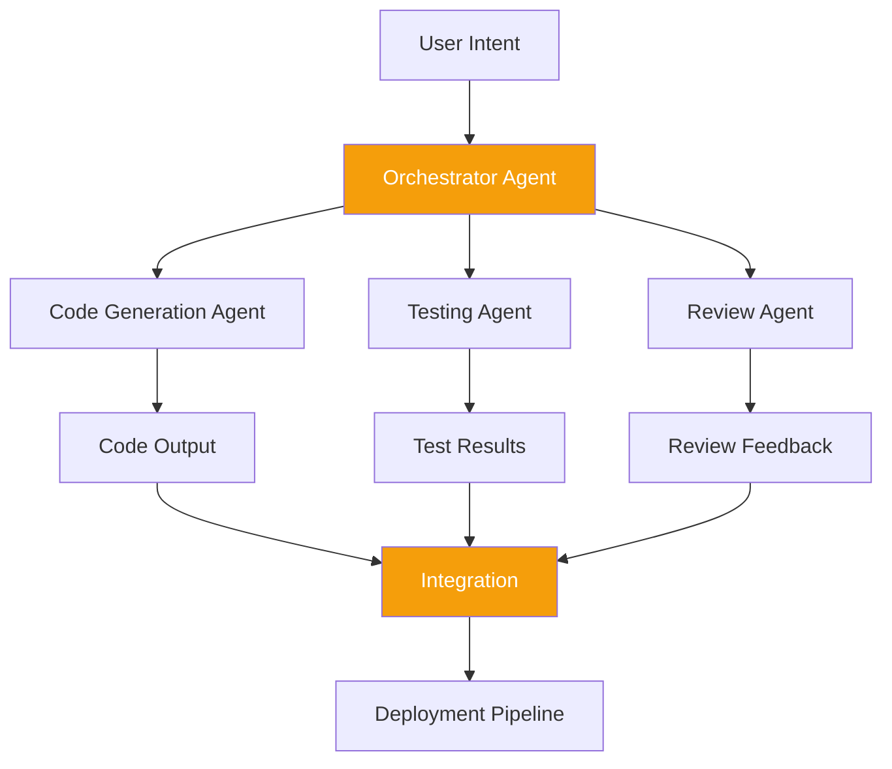

## The Problem

Modern software development involves a staggering number of repetitive yet context-dependent tasks: writing boilerplate, updating tests after refactors, drafting documentation, reviewing pull requests for common issues, and triaging build failures. Individual AI coding assistants help with isolated tasks, but they lack the ability to coordinate across a full development workflow. Each interaction starts from scratch, losing the accumulated context of a project's conventions, architecture decisions, and team preferences.

The question I set out to answer was whether multiple specialized AI agents could be orchestrated to handle end-to-end development workflows while maintaining shared context and respecting the constraints of real-world codebases.

## The Approach

AgentFlow is an orchestration framework that decomposes development tasks into discrete stages, each handled by a specialized agent. A planning agent breaks down high-level requests into concrete subtasks. A code generation agent produces implementations that follow project-specific patterns extracted from the existing codebase. A testing agent generates and runs test cases, iterating on failures. A review agent checks the output against coding standards, security guidelines, and architectural constraints.

The key innovation is a shared context layer that maintains project knowledge, including dependency graphs, coding conventions, recent changes, and known patterns, and makes it available to each agent without requiring redundant exploration. Agents communicate through structured messages, and the orchestrator manages dependencies between stages, handling retries and escalation to human review when confidence is low.

## Results

AgentFlow is currently in active development and early experimentation. Initial prototypes demonstrate that multi-agent orchestration can reduce the manual effort for routine development tasks like adding CRUD endpoints, writing integration tests, and updating documentation. The shared context layer significantly reduces the redundant codebase exploration that single-agent approaches require. The project serves as a proving ground for ideas about how AI-augmented development workflows might evolve beyond simple code completion.
