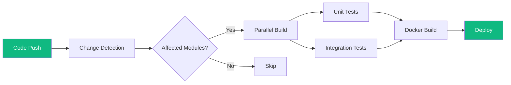

import BuildTimeChart from '../../components/charts/BuildTimeChart.astro';

## The Problem

Our team was shipping features across a multi-module Gradle monorepo with over 30 microservices. The CI/CD pipeline had grown organically over two years and was averaging 45 minutes per build. Developers were batching changes to avoid the feedback loop, which led to larger, riskier deployments and more merge conflicts. The slow pipeline was the single biggest drag on team velocity.

Profiling the pipeline revealed several compounding issues: every build compiled all modules regardless of what changed, test suites ran sequentially, Docker layer caching was nonexistent, and dependency resolution hit remote repositories on every run. The infrastructure itself was undersized, with builds queuing behind each other during peak hours.

## The Approach

I took a three-phase approach. First, I introduced Gradle build caching and configured remote cache nodes shared across CI runners, eliminating redundant compilation for unchanged modules. I also implemented change-detection logic in GitHub Actions so that only affected modules and their dependents would build on each push.

Second, I restructured the test execution strategy. Unit tests ran in parallel across multiple runners using Gradle's `maxParallelForks`, while integration tests that required Testcontainers were isolated into a separate stage with dedicated resources. Docker builds were refactored to use multi-stage builds with proper layer ordering so that dependency layers were cached across builds.

Third, I right-sized the CI infrastructure by moving to larger runner instances during business hours and implementing auto-scaling to handle peak load without queuing.

## Results

<BuildTimeChart beforeMinutes={45} afterMinutes={9} beforeLabel="Before" afterLabel="After" />

The average pipeline time dropped from 45 minutes to under 10 minutes — a 78% reduction. Developers began pushing smaller, more frequent changes, and deployment frequency increased by 3x within the first month. The remote build cache alone saved over 200 hours of cumulative compute time per month, significantly reducing CI costs alongside the time savings.
