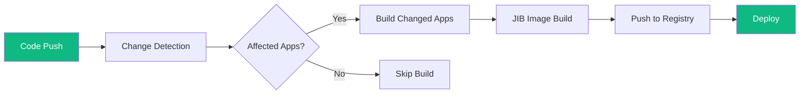

import BuildTimeChart from '../../components/charts/BuildTimeChart.astro';

## The Problem

I was working at a law-tech company with a small engineering team, seven of us total, including the VP of Engineering. Six months earlier, the company had cut ties with the contracting firm that originally built and maintained the entire platform. We were still discovering "bombs" the contractors had left behind: tangled library dependencies, badly constructed applications, and infrastructure decisions that no one on the internal team had been consulted on.

The platform was a Micronaut 1 monolith comprising 32 Gradle projects: 17 applications and 15 libraries. The CI pipeline was a single GitLab build job that used a Dockerfile to sequentially build every application's Docker image and push it to the container registry. Even if I changed a single line in one application, the pipeline rebuilt all 17 images. With Snyk security scanning enabled, pipeline times hit 47 minutes. Without Snyk, they still ran around 34 minutes. There was no parallelism, no change detection, and no way to build or test images locally.

## The Approach

I hadn't set out to fix the pipeline. I'd been tasked with upgrading the monolith from Micronaut 1 to Micronaut 4, a major migration that also meant moving from Hibernate 5 to 6, Java 11 to 17, and Gradle 7 to 8. The slow CI was painfully impeding my dev cycle on that upgrade work, so I started solving the build problem as a prerequisite.

First, I replaced the Dockerfile-based builds with the **Gradle JIB plugin**. JIB builds container images directly from Gradle without needing a Docker daemon, which meant I could build and push images locally during development instead of waiting for CI. This alone transformed my feedback loop on the Micronaut 4 migration.

Second, I **rewrote the Gradle build structure** to be modern and modular, untangling the library dependencies that the contractors had left intertwined. This was necessary groundwork; without clean dependency boundaries, change detection would have been impossible.

Third, I created **child `gitlab-ci` files for each application** with rules that only triggered a build and deploy when that specific app's code, or the code of any library it depended on, had changed. Instead of one monolithic job rebuilding everything, each application had its own targeted pipeline.

The tipping point for merging these changes into the main branch came when the VP of Engineering hit the same 40-minute wall while trying to get logging and metrics instrumentation deployed. He started voicing what the whole team had been quietly enduring. I took the opportunity to migrate the JIB and CI changes I'd already built and proven on my upgrade branch into master.

## Results

<BuildTimeChart beforeMinutes={47} afterMinutes={8} beforeLabel="Before (with Snyk)" afterLabel="After" />

Pipeline times dropped from 47 minutes to under 8 minutes, an 83% reduction. The numbers come directly from GitLab's pipeline analytics, where we could see both total pipeline time and per-job breakdowns. Even without Snyk in the comparison, the improvement was dramatic: 34 minutes down to under 8.

I identified, pitched, and executed this entirely on my own over the course of three weeks, while simultaneously making progress on the Micronaut 4 upgrade that had motivated the work in the first place. The optimized pipeline removed what had been the single biggest source of friction for the entire seven-person engineering team, a team that was already stretched thin recovering from the contractor transition.
