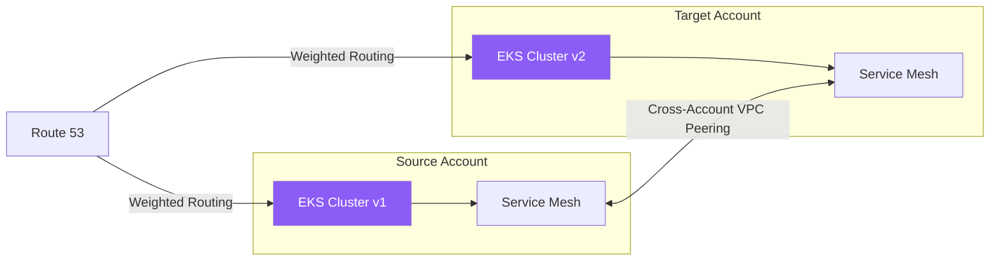

## The Problem

Our organization needed to migrate multiple EKS clusters from a legacy AWS account structure to a new multi-account landing zone. The clusters ran over 100 production services handling real-time traffic, and the business requirement was clear: zero customer-facing downtime during the migration. The legacy clusters were running outdated Kubernetes versions, had accumulated configuration drift, and used networking patterns incompatible with the new account topology.

Adding to the complexity, services communicated through a mix of internal load balancers, service mesh routes, and direct pod-to-pod networking. Any migration strategy had to maintain all of these communication paths during the transition period when services would be split across old and new clusters.

## The Approach

I designed a phased migration strategy anchored by cross-account VPC peering and a shared service mesh control plane. First, I established network connectivity between the old and new accounts using AWS Transit Gateway, ensuring pods in the new clusters could communicate with services still running in the legacy environment. An Istio service mesh spanned both clusters, providing transparent service discovery and traffic routing across the boundary.

The migration itself used a blue-green pattern at the service level. Each service was deployed to the new cluster, validated through automated smoke tests, and then traffic was gradually shifted using weighted routing in the mesh. I built a custom migration controller that automated the sequence: deploy, validate, shift traffic, monitor, and either promote or rollback. Rollback was automatic if error rates exceeded thresholds during the traffic shift window.

## Results

All 100+ services were migrated over a four-week period with zero minutes of customer-facing downtime. The automated migration controller handled 85% of services without manual intervention. The new clusters run current Kubernetes versions with standardized configurations managed through GitOps, reducing operational toil and improving the team's ability to apply security patches and upgrades going forward.
