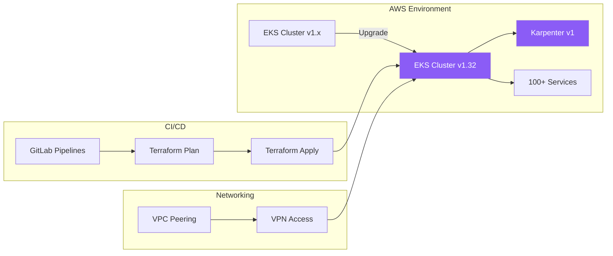

## The Problem

I was the only engineer on a seven-person team with DevOps and infrastructure experience. After the contractors who had originally built our infrastructure left, I became the default DevOps engineer — despite it being my least favorite part of the stack.

The immediate problem was our EKS clusters. They were running outdated Kubernetes versions that were approaching end of standard support, and AWS would begin charging extended support fees for every cluster that wasn't upgraded to 1.32. With multiple clusters running over 100 production services, those charges would add up fast. On top of that, the Terraform codebase the contractors had left behind was in rough shape — plans wouldn't validate cleanly, and there were issues in both the plan and apply stages that had to be resolved before any upgrade work could begin.

The biggest technical challenge was Karpenter. Our clusters were running a pre-v1 version, and the upgrade to Karpenter v1 was a significant breaking change that touched node provisioning, configuration schemas, and cluster autoscaling behavior. Getting that migration right was critical — Karpenter manages the compute that all our services run on.

To complicate matters further, midway through the upgrade project we signed a deal with Duplo Cloud to eventually migrate our environments to their platform. But we couldn't stop the EKS upgrade — the extended support charges were already looming. I had to finish the work knowing the infrastructure would eventually be migrated anyway. It was a pragmatic call: pay the charges or finish the upgrade. We finished the upgrade.

## The Approach

I started by stabilizing the existing Terraform. The entire infrastructure lived in a single Terraform repository, and I had to fix validation errors and broken plan/apply pipelines before I could safely make changes. Once the Terraform was healthy, I planned the EKS upgrade rollout.

Each upgrade was planned carefully with multiple dry runs to verify correctness before touching production. VPC peering provided VPN connectivity for engineer access during the process. GitLab CI/CD pipelines ran Terraform plan and apply stages, and I tested each change against a fresh environment to confirm the Terraform was complete and valid — effectively a disaster recovery validation at the same time.

The Karpenter v1 migration was the hardest part. The upgrade introduced breaking changes to node pool configuration and provisioner behavior. After each upgrade, there were leftover Karpenter nodes from previous versions that wouldn't drain cleanly and required manual cleanup — that was where most of the hands-on intervention happened.

I was the sole person involved in planning, executing, and validating every rollout.

## Results

All 100+ services were upgraded over a four-week period with zero minutes of customer-facing downtime. The bulk of the process was automated through Terraform and GitLab CI/CD pipelines, though Karpenter node cleanup and certain edge cases required manual intervention. The upgraded clusters now run EKS 1.32 with Karpenter v1, avoiding extended support charges and leaving the infrastructure in a clean state — whether for continued use or the eventual Duplo Cloud migration.

Disaster recovery was validated as a side effect of the process: because I tested every Terraform plan in a clean environment, we confirmed that our infrastructure could be fully recreated from code.
