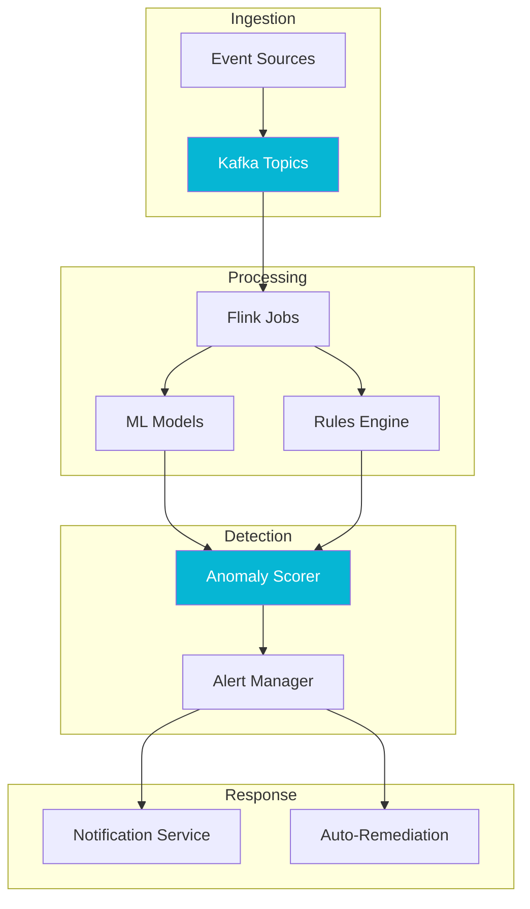

## The Origin Story

I have spent the better part of my career building data ingestion and detection systems. At **Banjo Inc**, I worked on platforms spanning corporate security, breaking news detection, and election monitoring. At **Globality**, the problem was bulk product acquisition. At a **public health company**, I built systems that detected disease outbreaks and assessed risk in real time — including standing up my own Apache Flink StateFun platform that mixed multiple languages in the processor functions.

Each time, the core architecture was the same: ingest high-volume event streams, apply rules and models to detect meaningful signals, and alert the right people. I built these systems in Ruby, Java, Python, and TypeScript. After doing it enough times across enough domains, the pattern crystallized: *with so many use cases, I wanted to build the ultimate polymorphic engine powered by data.*

EventHorizon is that engine — a generic, pluggable platform for data ingestion, detection, and alerting that can be adapted to any domain.

## The Architecture

I chose Apache Flink as the stream processing core because of deep familiarity — having built a full StateFun platform on it previously — and because its stateful processing model handles everything from low-volume feeds to extremely high-throughput event streams without imposing an artificial ceiling. Kafka serves as the event backbone, and Micronaut 4 (on Java 21) provides lightweight HTTP endpoints for configuration, health checks, and the management API.

The architecture follows a layered approach with pluggable capabilities at each stage:

The rules engine is designed to be domain-agnostic — the same core can power security detection, supply chain monitoring, public health surveillance, or any other use case by swapping configuration and detection rules rather than rewriting infrastructure.

For ML and LLM integration, I am working with Ollama for local model inference. The ML components use a sidecar pattern where anomaly scoring models run alongside Flink operators, while LLM integration correlates detections with contextual data to generate human-readable explanations — reducing the cognitive load on whoever is responding to alerts.

## Current State

EventHorizon deploys and runs end-to-end in a local Minikube cluster on an M4 Max with 64 GB of RAM — and it stresses the hardware. All components are functional: Kafka ingestion, Flink processing, the rules engine, ML scoring, and LLM-powered contextual enrichment via Ollama.

What it has not yet had is a proper scale test. Running AI inference with shared memory on a laptop is obviously constrained, and the event throughput ceiling in Minikube is far below what Flink can handle in a real cluster. The next step is deploying to EKS or GKE for genuine performance testing at volume.

## What Comes Next

Beyond scale testing, EventHorizon's architecture has opened up an unexpected direction. The rules engine and pluggable data ingestion layer have the bones of something broader — a knowledge-sharing platform for AI agents. That insight is where the idea for AgentFlow originated: if the engine can ingest arbitrary data, apply composable rules, and route actionable signals, it can orchestrate agent workflows just as well as it detects anomalies.

EventHorizon is both a working platform and a proving ground — a place to push the boundaries of what a single, well-designed streaming architecture can do across domains.
