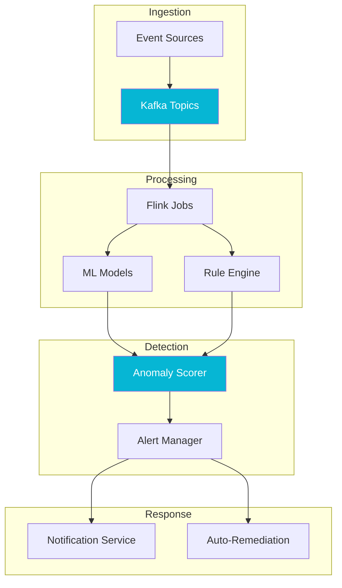

## The Problem

Traditional monitoring systems rely on static thresholds and predefined rules, which means they can only catch problems you already know about. As system complexity grows, the number of unknown failure modes grows even faster. Our operations team was spending significant time investigating false alerts from rigid threshold-based monitors, while genuine anomalies in complex, multi-service interactions went undetected until customers reported them.

We needed a platform that could ingest high-volume event streams from dozens of services, detect subtle deviations from normal behavior in real time, and provide actionable context to on-call engineers without overwhelming them with noise.

## The Approach

I designed EventHorizon as a streaming-first platform built on Apache Flink for stateful stream processing and Kafka as the event backbone. Micronaut serves as the application framework, providing lightweight HTTP endpoints for configuration, health checks, and a management API. The architecture follows a layered detection approach: statistical models handle baseline drift detection, while Flink CEP identifies complex event patterns across service boundaries.

The ML integration uses a sidecar pattern where lightweight anomaly scoring models run alongside Flink operators. For novel or ambiguous anomalies, the system leverages LLM integration to correlate detections with recent deployment events, configuration changes, and historical incident data, generating human-readable explanations. This contextual enrichment dramatically reduces the mean time to understand an alert.

## Results

EventHorizon processes event streams with end-to-end detection latency under 200 milliseconds. The platform reduced false-positive alerts by over 60% compared to the previous threshold-based system, while catching categories of anomalies that were previously invisible. On-call engineers reported that the LLM-generated context summaries cut their initial triage time roughly in half, allowing them to focus on resolution rather than investigation.
