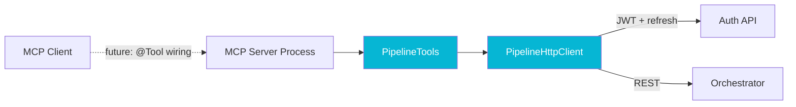

## The Problem

Once the [pipeline platform](/case-studies/pipeline-platform) had a real REST surface and a real auth boundary, the next natural extension was tooling for AI agents. Model Context Protocol (MCP) was the obvious shape: expose pipeline operations as tools that an agent can call, with the platform's existing auth boundary doing the gating.

The wrinkle was that `micronaut-mcp`, the library I wanted to use, was actively churning on the day I sat down to build this. Three versions were in flight at once, each with a different annotation style and a different JVM requirement. Committing to any of them meant committing to a JVM upgrade or a framework downgrade, and the cost of getting it wrong was a rewrite as soon as the framework stabilized.

## The Approach

The decision I made was unfashionable and correct: **ship the data plane now, defer the framework until the library lands.**

The pieces that were ready to commit to went in. `PipelineHttpClient` handles auth, automatic refresh on 401, and the request/response marshalling. `TokenStore` holds the operator's credentials in memory with a tested rotation path. `PipelineTools` is a set of ten methods that map one-to-one onto the MCP tools I plan to expose, each fully typed against the orchestrator's REST API. All of it compiles, all of it has tests, all of it works exactly the same way no matter which `micronaut-mcp` annotation style eventually wins.

The pieces that depended on framework choices stayed commented out. The `@Tool` annotation in version `1.0.0-RC1` requires JVM 25; the verbose factory API in `1.0.0-M1` through `M3` needs JVM 21; the legacy API in `0.0.20` works on JVM 17. The platform's existing services run on JVM 17, so committing to any of the newer lines would have meant a parallel JVM upgrade across multiple services as a precondition for shipping the MCP scaffold. That trade did not pay off; the scaffold can wait, the JVM upgrade should happen on its own schedule.

The repository ships with a README that documents the path forward: which framework line to pick, which JVM that implies, and which methods need annotations once the framework is wired. The next person to touch this repo, including a future me, can pick up where I left off without having to reverse-engineer what was load-bearing and what was provisional.

## Results

The MCP bridge sits in its repository as ten working tools with no framework runtime, which is exactly enough to keep me honest about the data model and zero more than that. When `micronaut-mcp` stabilizes on a JVM line we already deploy, wiring the framework will be a small, mechanical change. If it stabilizes on a JVM line we do not, we will know that fact when we are making the JVM upgrade decision on its merits, not under the implicit deadline of an MCP shipping date that we never actually had.

The shape generalizes. **When a framework's API is in flux, build everything that does not touch the framework first.** The domain logic, the typed clients, the integration tests against external systems: all of that is buildable today regardless of which API the framework eventually picks. The framework wiring is the last few inches of the build, not the foundation. Treating it that way buys you the option value of choosing later without paying for it in churn now.
