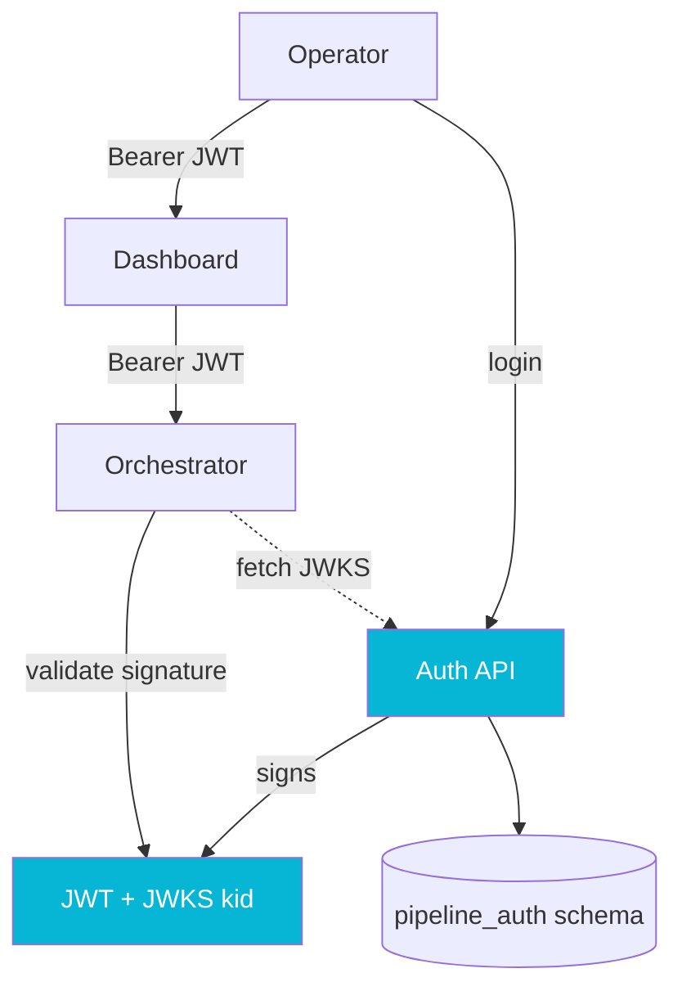

## The Problem

The pipeline platform had write surfaces that mattered: court configuration editors, jurisdiction rule editors, and a patch-and-replay tool that operators used to recover from bad processing runs. All three were gated only by the DuploCloud perimeter, which is to say: anyone past the network edge could mutate them without identity. We needed real authentication and we needed it without taking the legacy system down or making the new platform depend on legacy uptime.

Three options were on the table. Federate to the existing legacy auth service: rejected, because it would have coupled the new platform's uptime to the legacy stack we were trying to escape. Deploy Keycloak: rejected, because the operational footprint was disproportionate to a small operator population. Build a standalone JWT issuer owned by the pipeline platform: accepted, and that is what shipped.

## The Approach

The auth service is a Micronaut 4 application with its own Postgres schema (`pipeline_auth`), its own database role, and its own signing keys. It exposes a small surface: login, refresh, logout, a JWKS endpoint for downstream services, and an admin-only user-management API.

The orchestrator's resource server validates JWTs against the auth API's JWKS endpoint over the cluster's internal DNS, never the external URL. The dashboard treats the JWT as opaque and presents it as a Bearer token on every call. Signing keys are generated by a Gradle task (`./gradlew rotateSigningKey`) and live in a `signing_key` table; the active key is identified by its `kid`, and the JWKS endpoint serves whichever keys are currently in play, so rotation is a database operation, not a redeploy.

The interesting decision was the cutover. The existing write surfaces were already in production with their own routes (`/pipeline/court-config/*`, `/pipeline/replay/*`). Adding JWT enforcement to those routes the day we shipped auth would have logged out every operator mid-flight. Instead, every controller was registered under **two** paths: the existing legacy-style path, and an `/api/pipeline/*` alias. The new routes carry JWT enforcement; the legacy ones keep their existing perimeter-only gating until the last operator client migrates over. The aliasing is a one-line `@Controller({"/pipeline/foo", "/api/pipeline/foo"})` change per controller. The migration is a window, not a flag day.

A long tail of small infrastructure issues cost more time than any of the code. Worth writing down so the next person does not pay them again.

**AWS ALB does not strip prefixes** on `pathType: ImplementationSpecific`. The fix is to bake the prefix into the `@Controller` annotation, which matches the convention the orchestrator and the legacy auth service already used.

**The Micronaut placeholder parser splits on every `:` in defaults.** A property like `${AUTH_JWKS_URL:http://host:8080/path}` silently resolves to `8080/path` when `AUTH_JWKS_URL` is unset, because the parser treats the colon between host and port as a placeholder default separator. Workaround: a two-step indirection through a plain non-defaulted property.

**The shared dev Postgres had CITEXT and pgcrypto pre-installed in a `private` schema.** `CREATE EXTENSION ... WITH SCHEMA public` was silently ignored because the extensions already existed elsewhere. The migration now contains a self-healing `DO $$ ... $$` block that detects the extension's actual schema and sets the session `search_path` accordingly before running anything that depends on `citext`.

**DuploCloud's pod probe path does not change when you add a service prefix**, because the kubelet hits the pod IP directly and bypasses the ALB. Easy to miss; obvious in hindsight.

**`MICRONAUT_ENVIRONMENTS=prod` must be set explicitly** on the Duplo service. Without it, `application-prod.yml` simply never loads, the datasource URL falls back to localhost, and the pod fails its readiness probe with a confusingly generic database error.

## Results

Phase 1 of pipeline auth shipped to dev01 across three repos and roughly fourteen merge requests, with zero operator downtime. The legacy perimeter-only routes kept working while operators migrated to the JWT-aware ones, and the legacy routes will be retired in Phase 2 once usage hits zero. Signing-key rotation is a single Gradle task and a database update. The auth API is the only service that owns key material, and it has zero hard dependencies on the legacy stack, which means the next time the legacy stack has an outage, the pipeline platform's operators can still log in.
