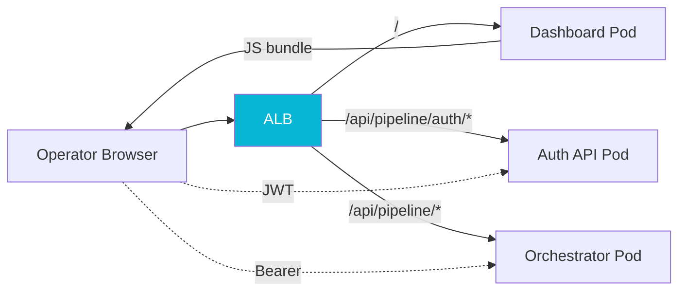

## The Problem

Once the [pipeline orchestrator](/case-studies/pipeline-orchestrator) and [workers](/case-studies/pipeline-workers) were running, operators needed somewhere to look. The legacy system surfaced its state through log lines and the occasional database query, which had aged badly. We wanted a real observability surface: live processing contexts, the DAG steps each was at, recent failures, and an audit trail of who touched what.

The temptation was to give that surface write power of its own. "While we are building a dashboard, let us also let it edit court configs and trigger replays." Operators did eventually get both of those features, but the temptation, as stated, is wrong. A dashboard that *owns* mutations is a third place that has to be authorized, audited, validated, and tested for every write the platform supports. A dashboard that merely renders the owning service's API is a screen. The distinction decided the architecture.

## The Approach

The dashboard is a Vue 3 SPA. It launched read-only: processing contexts, live DAG state rendered as an SVG graph, step timelines, failure drill-downs. The write features came later and deliberately: versioned court-config and jurisdiction-rule editors (an embedded Monaco editor over JSON-schema-validated config), and a patch-and-replay action on failed steps. Every one of those mutations lives in the orchestrator's own controllers, gated by JWTs from the auth service; the dashboard calls them but does not own them. The SPA's contract never changed: it owns no endpoints and no data.

The client side uses `wretch` with a small middleware stack that does two things. It injects the operator's Bearer token from a Pinia store (session-storage backed, so a refresh keeps the operator logged in for the session but a closed tab logs them out). And it transparently retries on `401`: a single refresh attempt against the [auth API](/case-studies/pipeline-auth), reapply the new token, replay the original request. Operators do not see token expiry; their session is either logged in or it is not.

The harder lesson was on the server side, and it had nothing to do with Vue.

The dashboard pod runs nginx. nginx was already proxying the dashboard's own API calls back to the orchestrator. So when we introduced a standalone auth API, the path-of-least-resistance proposal was "just add an `/api/pipeline/auth/*` location block to the dashboard nginx so the SPA can reach it." It would have worked. It was also wrong, and I closed the merge request that did it.

The dashboard's nginx serves the SPA. That is its job. **A REST API is meant to be reachable without a browser**, and putting the SPA's nginx in the path of a pure API route makes three things worse: the API's uptime now depends on the dashboard pod's uptime, the dashboard becomes a coupling point between unrelated services, and operators have to know a non-obvious mental model where "the auth API is reachable through the dashboard." The right answer is a K8s ingress rule that routes `/api/pipeline/auth/*` straight to the auth API pod, full stop. The dashboard nginx carries the SPA and only the SPA.

## Results

The dashboard still ships with zero endpoints of its own, even after growing a real write surface. Every mutation operators use (editing a court's config, adjusting a jurisdiction rule, patching and replaying a failed run) is owned by the service that owns the data, authorized by JWTs the auth API issues, and audited by the orchestrator's own audit columns. The payoff of the config editors is the platform's headline property made tangible: onboarding a court is an operator editing validated configuration in a browser, with zero deploys. Adding the operator login flow took roughly a day of Vue work; closing the wrong nginx merge request took five minutes and saved us an architectural mistake we would have spent six months unwinding.
