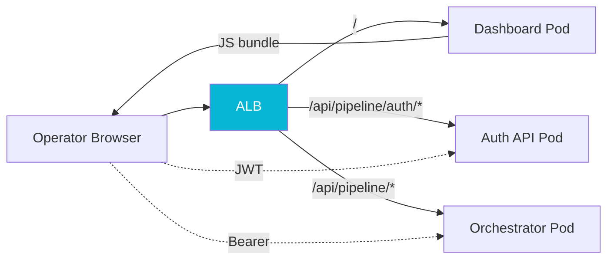

## The Problem

Once the [pipeline orchestrator](/case-studies/pipeline-orchestrator) and [workers](/case-studies/pipeline-workers) were running, operators needed somewhere to look. The legacy system surfaced its state through log lines and the occasional database query, which had aged badly. We wanted a real observability surface: live processing contexts, the DAG steps each was at, recent failures, and an audit trail of who touched what.

The temptation was to give that surface write power too. "While we are building a dashboard, let us also let it edit court configs and trigger replays." The temptation is wrong. A dashboard with write power is a third place that has to be authorized, audited, validated, and tested for every mutation the platform supports. A dashboard without write power is a screen.

## The Approach

The dashboard is a Vue 3 SPA. It reads from the orchestrator's REST API, renders processing contexts and DAG state, and that is the entire contract. Every mutation that an operator might want, from triggering a replay to editing a court configuration, lives in the orchestrator's own controllers, which the dashboard happens to call but does not own.

The client side uses `wretch` with a small middleware stack that does two things. It injects the operator's Bearer token from a Pinia store (session-storage backed, so a refresh keeps the operator logged in for the session but a closed tab logs them out). And it transparently retries on `401`: a single refresh attempt against the [auth API](/case-studies/pipeline-auth), reapply the new token, replay the original request. Operators do not see token expiry; their session is either logged in or it is not.

The harder lesson was on the server side, and it had nothing to do with Vue.

The dashboard pod runs nginx. nginx was already proxying the dashboard's own API calls back to the orchestrator. So when we introduced a standalone auth API, the path-of-least-resistance proposal was "just add an `/api/pipeline/auth/*` location block to the dashboard nginx so the SPA can reach it." It would have worked. It was also wrong, and I closed the merge request that did it.

The dashboard's nginx serves the SPA. That is its job. **A REST API is meant to be reachable without a browser**, and putting the SPA's nginx in the path of a pure API route makes three things worse: the API's uptime now depends on the dashboard pod's uptime, the dashboard becomes a coupling point between unrelated services, and operators have to know a non-obvious mental model where "the auth API is reachable through the dashboard." The right answer is a K8s ingress rule that routes `/api/pipeline/auth/*` straight to the auth API pod, full stop. The dashboard nginx carries the SPA and only the SPA.

## Results

The dashboard ships with zero write endpoints. Every mutation operators want is owned by the service that owns the data, authorized by JWTs the auth API issues, and audited by the orchestrator's own audit columns. Adding the operator login flow took roughly a day of Vue work; closing the wrong nginx merge request took five minutes and saved us an architectural mistake we would have spent six months unwinding.
