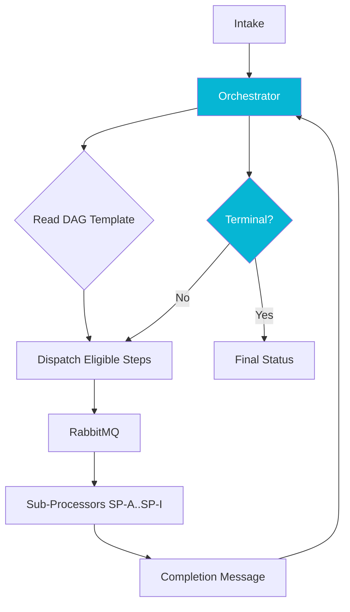

## The Problem

The legacy receipt-processing system at a law-tech startup had grown to 534 concrete Java processor classes, one per court jurisdiction. Each new court onboarding meant new code, a new deployment, and a fresh round of regression testing. The fan-out had also become unmaintainable: a small change to a shared step required touching hundreds of files, and the cumulative branching logic obscured what every processor actually did.

I wanted a single engine that read its behavior from configuration instead of code. Courts would be onboarded by adding rows to a database table, not by writing and shipping Java.

## The Approach

I designed Pipeline Orchestrator as a config-driven DAG engine on Micronaut 4 and Postgres. Each court is represented by a DAG template (Patterns A through E) defined in a Flyway-managed seed migration. At runtime the orchestrator instantiates a processing context, dispatches the eligible steps to RabbitMQ for sub-processors to execute, then merges their results back into a JSONB column on the context as completion messages arrive.

Three invariants kept the engine honest. First, **terminal evaluation** is not just a check for "no more steps." Some DAGs halt early (duplicate detected, case sealed), so the orchestrator evaluates terminal state both before and after dispatch, and a step's halt signal must short-circuit the dispatch loop, not race it. Second, **optimistic-lock retry**: when two sub-processors complete at almost the same instant, both want to merge into the same JSONB document. A `@Version` field on the context plus a bounded retry loop with a fresh transactional read handles the collision without losing work. Third, **publish before commit is forbidden**: the RabbitMQ dispatch lives outside the `@Transactional` boundary, so a rollback never leaks a phantom message into the queue.

The DAG vocabulary is intentionally small. A step has a list of dependencies, an optional fallback step, and a terminal flag. There are no per-court hooks, no scripting language inside the config. Anything court-specific lives in the sub-processor, not the orchestrator.

## Results

A single deployable service now drives every court the platform supports, including patterns that previously required bespoke processors. Onboarding a new court is a Flyway migration plus sub-processor configuration, not a code change. Phase 1 of the rollout passed a formal architectural review on the third attempt: the first two iterations missed the half-logic in terminal evaluation and the publish-before-commit invariant. Those bugs would have produced phantom in-flight steps and rollback-silenced messages in production, and the gate caught them before any traffic flowed.
