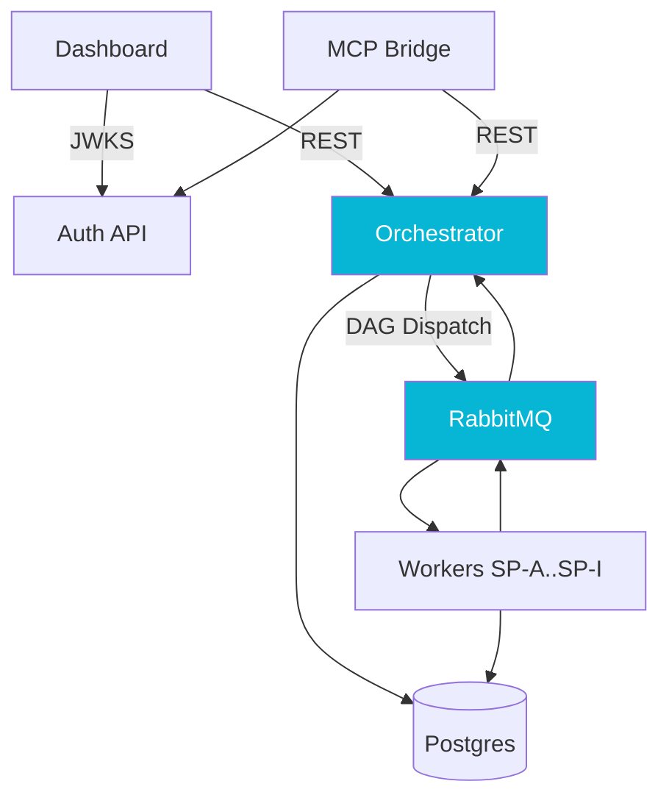

## The Problem

Receipt processing at a law-tech startup had been built one court at a time. Five years and 534 concrete processor classes later, every new jurisdiction meant another Java class, another deployment, and another set of regression risks. Observability lived in log lines, authentication was federated through a sprawling legacy system, and the entire pipeline rode inside the original monolith with no clear seam to extract.

I wanted a platform with seams instead of a monolith with conventions: a single engine that reads its behavior from configuration, a worker tier that owns the court-specific quirks, an observability surface for the operators who actually live in this system, and an authentication boundary that does not require the legacy system to be online.

## The Approach

The platform is five services with a deliberately small contract between them.

**Orchestrator** owns the DAG: it reads the template for the court, dispatches eligible steps, and merges sub-processor results into a single JSONB document per processing context. Terminal evaluation, optimistic-lock retry, and a strict publish-before-commit boundary make it safe under concurrent step completion. **Workers** host nine generic sub-processors (SP-A through SP-I) that subscribe to RabbitMQ topics, do their work, and emit completion messages. They never write to the orchestrator's state directly; they only return results. **Dashboard** is a read-only Vue 3 SPA that gives operators a view of every processing context in flight. **Auth API** is a standalone Micronaut JWT issuer with a JWKS endpoint, designed so the platform's authentication boundary does not depend on the legacy stack. **MCP Bridge** exposes a curated subset of platform operations to MCP-aware tooling.

The contract between services is shallow on purpose. The orchestrator is the only writer to its own JSONB. The workers are the only callers of the court-specific HTTP and email surfaces. The dashboard never mutates state. The auth API issues and rotates signing keys; nobody else owns key material. Each service has its own deployment cadence, its own database role, and its own ingress rule.

## Results

The platform replaced a 534-processor monolith with five services, each with a single responsibility and a clean cutover path. Onboarding a new court is now a Flyway migration plus configuration, not a Java class. Four phases of test-driven development with formal architectural review gates produced roughly 580 tests and surfaced three architecture-level defects (a multi-pod DDL race, half-logic in DAG terminal evaluation, missing consumer wrappers) before any of them reached production.

Each component is documented in its own case study: the [orchestrator](/case-studies/pipeline-orchestrator) and its DAG model; the [workers](/case-studies/pipeline-workers) and the read-only entity-scan trick that lets them share a database with the legacy system; the [dashboard](/case-studies/pipeline-dashboard) and the API-perimeter lesson it taught us; the [auth API](/case-studies/pipeline-auth) and the dual-controller alias pattern that made a zero-downtime cutover possible; and the [MCP bridge](/case-studies/mcp-bridge), where we shipped the data plane and deliberately deferred the framework.
