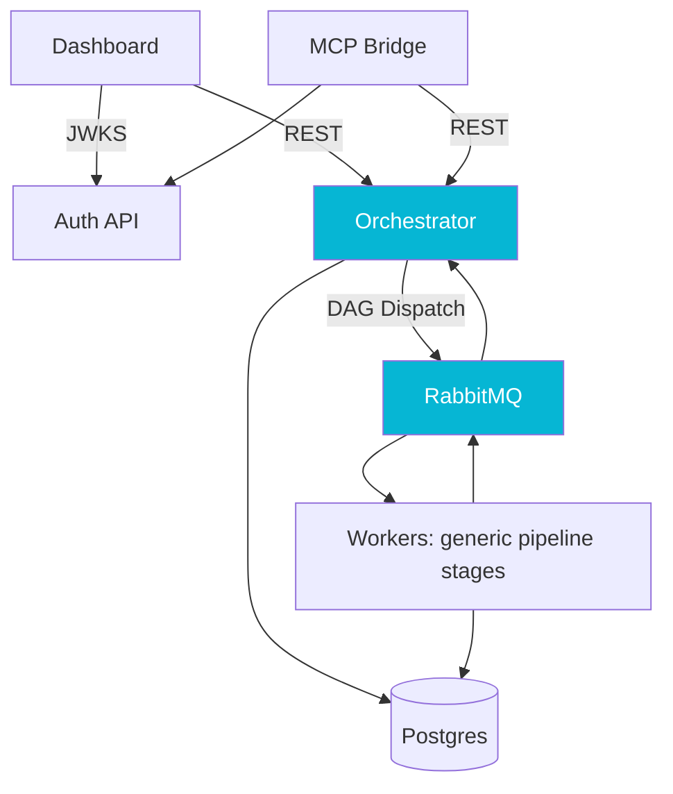

## The Problem

Court-document processing at a law-tech startup had been built one court at a time. Five years and 534 concrete processor classes later, every new jurisdiction meant another Java class, another deployment, and another set of regression risks. Observability lived in log lines, authentication was federated through a sprawling legacy system, and the entire pipeline rode inside the original monolith with no clear seam to extract.

I wanted a platform with seams instead of a monolith with conventions: a single engine that reads its behavior from configuration, a worker tier that owns the court-specific quirks, an observability surface for the operators who actually live in this system, and an authentication boundary that does not require the legacy system to be online.

## The Approach

The platform is four core services with a deliberately small contract between them, plus an MCP bridge taking shape alongside them.

**Orchestrator** owns the DAG: it reads the template for the court, dispatches eligible steps, and merges sub-processor results into a single JSONB document per processing context. Terminal evaluation, optimistic-lock retry, and a strict publish-before-commit boundary make it safe under concurrent step completion. **Workers** host ten generic pipeline stages (content extraction, jurisdiction matching, case lookup, deduplication, authentication, document fetch, sealed handling, fallback capture, envelope assembly, and storage) that subscribe to RabbitMQ queues, do their work, and emit completion messages. They never write to the orchestrator's state directly; they only return results. **Dashboard** is a Vue 3 SPA that gives operators a view of every processing context in flight, plus versioned config editors and a patch-and-replay surface whose mutations all belong to the orchestrator's API. **Auth API** is a standalone Micronaut JWT issuer with a JWKS endpoint, designed so the platform's authentication boundary does not depend on the legacy stack. **MCP Bridge**, still in progress, exposes a curated subset of platform operations to MCP-aware tooling.

The contract between services is shallow on purpose. The orchestrator is the only writer to its own JSONB. The workers are the only callers of the court-specific HTTP and email surfaces. The dashboard owns no data and no endpoints; every mutation it offers is a call into the service that owns the record. The auth API issues and rotates signing keys; nobody else owns key material. Each service has its own deployment cadence, its own database role, and its own ingress rule.

## Results

The platform replaced a 534-processor monolith with four focused services, each with a single responsibility and a clean cutover path. Onboarding a new court is now configuration (versioned rows behind a JSON-schema-validated write API, edited from the dashboard), not a Java class and not a deploy. The core services run Micronaut 5 on Java 25, adopted mid-build without pausing feature work. Four phases of test-driven development with formal architectural review gates produced roughly 580 tests at the final gate (a suite since grown past 1,100) and surfaced three architecture-level defects (a multi-pod DDL race, half-logic in DAG terminal evaluation, missing consumer wrappers) before any of them could ship.

Each component is documented in its own case study: the [orchestrator](/case-studies/pipeline-orchestrator) and its DAG model; the [workers](/case-studies/pipeline-workers) and the read-only entity-scan trick that lets them share a database with the legacy system; the [dashboard](/case-studies/pipeline-dashboard) and the API-perimeter lesson it taught us; the [auth API](/case-studies/pipeline-auth) and the dual-controller alias pattern that made a zero-downtime cutover possible; and the [MCP bridge](/case-studies/mcp-bridge), where we shipped the data plane and deliberately deferred the framework.
