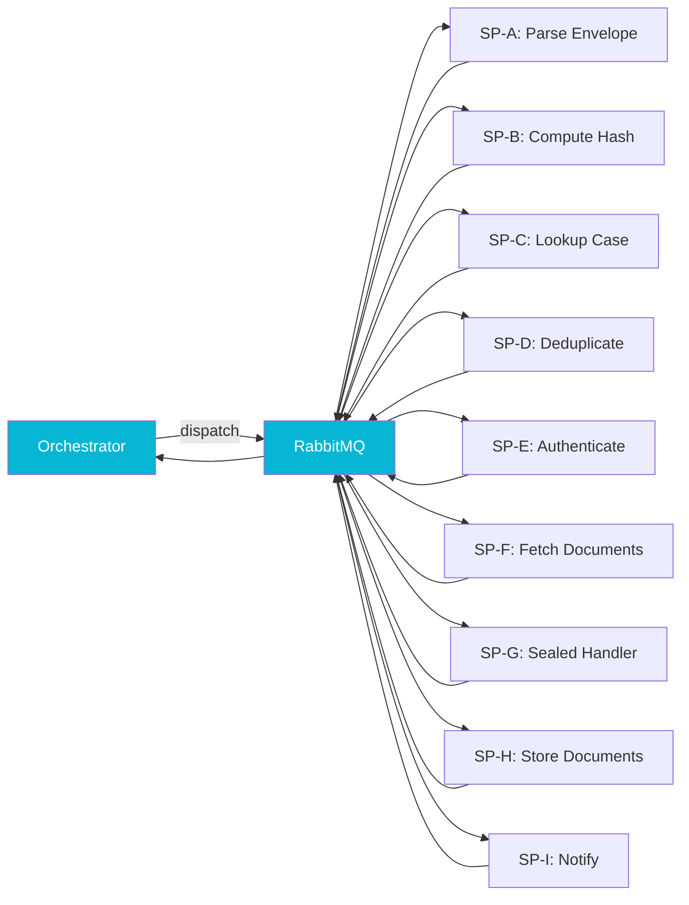

## The Problem

The orchestrator gave us a config-driven DAG, but the DAG is only as generic as the steps inside it. The legacy system had 534 court-specific processor classes because every court had its own envelope format, its own deduplication rule, its own credential flow, and its own document store conventions. If the new platform shipped 534 court-specific workers, we had moved the problem, not solved it.

I also had a hard constraint: the workers had to share a Postgres instance with the legacy system in dev and production. Different schema, same database. Hibernate's default behavior under `hbm2ddl.auto: update` would have happily reached across to the legacy tables and tried to "fix" them.

## The Approach

I collapsed the 534 court-specific processors into nine generic **sub-processors** keyed by capability rather than jurisdiction:

Each sub-processor is a `@RabbitListener` consumer wrapping a pure utility class. The utility takes a typed input, does its job, and returns a typed output. The consumer wrapper handles message decoding, error envelope, and the completion publish back to the orchestrator. Court-specific behavior is configuration: regex patterns for envelopes, hash algorithms per court (SHA-512 and SHA-256, not the SHA3-224 the original PRD mistakenly named), credential flow types, and document storage targets all live in seeded rows, not in code.

Three details made the workers safe to deploy alongside the legacy system.

**Session tokens never persist.** SP-E (Authenticate) returns only the auth-result metadata to the orchestrator. The session cookie or bearer token rides in the dispatch message to SP-F (Fetch Documents) and is discarded after use. The orchestrator's JSONB column never holds credential material. The [companion essay on replay idempotency](/writing/replay-idempotency-stateful-pipelines) covers why that decision matters for replays.

**Workers are read-only at the database level.** I locked Hibernate to `hbm2ddl.auto: validate` in every environment and restricted entity scanning to the worker package so Hibernate has no idea the legacy tables exist. Even a misconfigured pod cannot issue DDL against the shared database. The `validate` mode also doubles as a deploy-time check that the workers' view of the schema is consistent with the migrations the orchestrator owns.

**The orchestrator owns all JSONB writes.** Workers never mutate the processing context. They emit a completion message; the orchestrator merges. Combined with the orchestrator's `@Version` optimistic-lock retry, this gives us serializable-by-construction state evolution without distributed transactions.

## Results

Nine sub-processors now cover everything the original 534 processors did, plus an extensible surface for the next round of courts. Adding a court is a Flyway migration that seeds a DAG template plus per-court configuration for whichever sub-processors that court touches. A formal Phase 2 architecture review caught a `hbm2ddl.auto: update` setting in the workers' base config before any pod ever ran in production, and the entity-scan restriction stopped a class of cross-tenant accidents that the legacy system had never been forced to think about.
