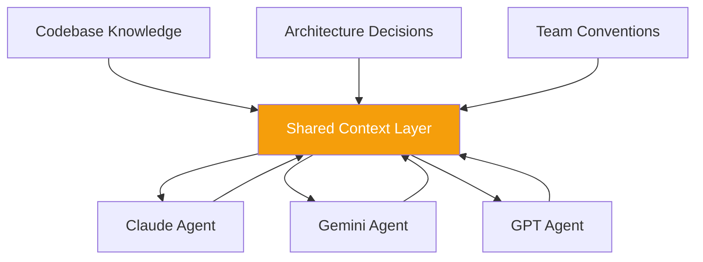

## The Insight

I spend a lot of time working with Claude Code. It is genuinely good at what it does. But the moment I want to bring in another model — Gemini for a second opinion on architecture, GPT for a different perspective on a prompt — I'm back to copying context by hand. Each agent starts cold. The accumulated understanding of my codebase, my conventions, my constraints — all of it stays locked inside a single session.

That friction led to a question: what if agents could share context in near real-time, regardless of which model powers them?

## Where the Idea Comes From

My work on [EventHorizon](/case-studies/event-horizon) gave me a strong intuition for this problem. EventHorizon is a real-time data ingestion and detection platform built on Flink and Kafka — it ingests streams of data, applies rules, and surfaces insights. The rules engine and the way it handles streaming data ingestion map naturally onto an agent coordination problem. A shared knowledge layer for agents is, at its core, a specialized data pipeline: ingest context, apply rules about what matters, and make it available to consumers in real time.

The difference is that the consumers are AI agents, and the "data" is project context — dependency graphs, recent changes, architectural decisions, team preferences.

## What AgentFlow Would Be

AgentFlow is a concept for an enterprise agent orchestration platform. The core differentiator is the shared context layer: a persistent, streaming knowledge base that any connected agent can read from and write to, regardless of the underlying model.

An orchestrator would route tasks to specialized agents based on their strengths, while the shared context layer ensures none of them start from scratch. Think less "chatbot wrapper" and more "enterprise agent runner" — something teams would deploy to coordinate AI-assisted workflows across their entire development process.

## Current Status

This is concept-stage. There is no working code or repository yet. What exists is a set of ideas informed by years of building real streaming systems across multiple industries and by heavy daily use of AI coding tools. The agent tooling space is evolving rapidly, and if the right pieces come together — particularly around shared memory between models — this is what I intend to build next.
