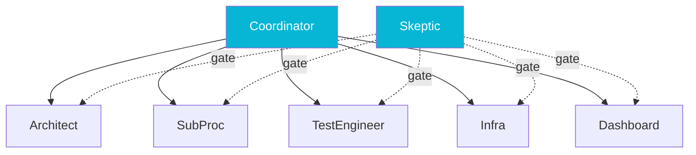

## The Problem

Working with a single AI agent on a project larger than a few thousand lines runs into a wall. The context window is finite, the conversation drifts, the agent forgets architectural decisions it made an hour ago, and you spend an increasing share of every prompt re-anchoring it. The temptation is to spawn a fresh agent for every task, but then you lose continuity entirely: the new agent has no idea what conventions the codebase uses, no idea what the last agent decided, no idea why a particular abstraction looks the way it does.

I wanted something between "one agent for the whole project" and "anonymous agents for every task." On the [pipeline platform](/case-studies/pipeline-platform) build, that shape turned out to be a small standing team with named roles, branch isolation per teammate, and a hard rule for when a teammate gets replaced.

## The Approach

The team had six roles, each backed by a specific agent type and an explicit scope.

The **Architect** owned the orchestrator and the DAG engine. **SubProc** owned the generic pipeline stages. **TestEngineer** owned fixtures, the test driver, and the end-to-end suite. **Infra** owned Kubernetes manifests, CI, and the deployment story. **Dashboard** owned the Vue 3 SPA when its phase came up. **Skeptic** was the gate keeper, with a different agent type from everyone else, whose only job was to read the code and disagree with it.

Three rules made the team work.

**Each teammate owns their own feature branch.** Architect on `feat/orchestrator`, SubProc on `feat/sub-processors`, Infra on `feat/k8s-pipeline-services`, and so on. Branches never overlap; merges happen after the Skeptic approves the phase. The branch-per-teammate rule prevents the "two agents editing the same file" failure mode entirely.

**Replace at 25% context remaining.** When a teammate's context dropped below 25%, the team lead spawned a replacement (Architect-2, Architect-3) and the original sent a handoff direct message containing file paths in flight, recent decisions, and the open task. Below 15%, replacement happened without waiting for the handoff. The number that mattered was 25%, because below that the agent's quality drops noticeably before any visible failure: it starts forgetting where files live, repeating itself, and missing references to earlier context. Replace before the quality drops, not after.

**Teammates can spawn anonymous subagents but cannot spawn teammates.** This kept the roster flat and the resource use predictable. An Architect needing a quick code search can launch an unnamed Explore agent; an Architect needing a second pair of eyes on a design has to ask the Skeptic, not invent a new permanent role.

Two operational details made the rules sustainable. The **Skeptic gate** runs at every phase boundary with a categorized verdict (blockers, warnings, recommendations), so no teammate can ship past the phase without an outsider reading their code. And the team's configuration lives in a JSON file (`~/.claude/teams/<project>/config.json`) with `isActive` flags per teammate, so idle agents can be shut down between phases and verified-shut-down before the next phase opens.

## Results

Four phases, six standing roles, three Architect rotations, four Skeptic rotations, and zero branch collisions across the whole build. The platform hit its final gate with roughly 580 tests (a suite since grown past 1,100) and three architectural defects caught at the Skeptic gates (covered in detail in the [companion piece on phased TDD](/writing/phased-tdd-skeptic-gatekeeping)). The total agent-hours were a fraction of what a single long-running agent would have consumed, because the rotation rule cut off the long tail where context quality degrades faster than the work progresses.

Two patterns from the team experience generalize beyond this project. **Specialization beats generality for sustained work.** A teammate with a narrow scope and an explicit agent type produces better code than a generalist trying to context-switch between layers. **Rotation is a quality control, not a resource control.** The 25% threshold is not about saving tokens; it is about replacing the teammate before their judgment quietly gets worse. Treat the rotation as a hand-off discipline, not a budget discipline, and the rest follows.
