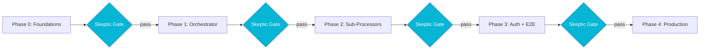

## The Problem

Test-driven development gives you confidence that the thing you built does what you said it does. It tells you nothing about whether the thing you said you would build is the right thing, whether the boundaries you drew are the right boundaries, or whether the deployment story you assumed is the deployment story you actually have. The bugs that survive a TDD suite are the bugs that the suite was structurally unable to ask about.

On the [pipeline platform](/case-studies/pipeline-platform) I built at a law-tech startup, three classes of bug fit that description exactly. A `hbm2ddl.auto: update` setting in the workers' base config that would have raced multiple pods against each other trying to alter shared schema. A terminal-evaluation path in the DAG engine that worked for every scenario the unit tests covered and was structurally wrong for the ones they did not. RabbitMQ consumer wrappers that the design assumed existed and the implementation had not gotten around to writing yet. Every one of those would have passed a thorough TDD suite and broken in production.

## The Approach

I added a gate between every phase. Not a meeting, not a checklist, not a retrospective: a formal architectural review by an explicit "Skeptic" role whose only job was to find what the TDD suite could not. The agent or human in that seat reads the actual code, runs the actual build, and produces a written verdict with three categories: **blockers** (must fix before the phase ships), **warnings** (must fix before the next phase ships), and **recommendations** (worth knowing about for the phase after that).

The four phases on this project were Foundations (entities, Flyway, fixtures), Orchestrator (DAG engine, dispatch, retry, terminal evaluation), Sub-Processors (the first six pipeline stages plus the first end-to-end traffic run), and Auth + Patterns (credential authentication plus the harder DAG patterns). Each phase has its own merge request, its own test suite, and its own Skeptic verdict before anyone touches the next one.

The gate caught three blockers that the test suites would not have caught on their own.

**Phase 0 blocker: `hbm2ddl.auto: update` in production config.** Hibernate's update mode silently no-ops in some failure cases and silently races itself in others when multiple pods start at the same time. The unit tests passed because TestResources spun up a fresh container per run. The fix was `validate` in prod plus a separate init job for schema migrations, which is unrelated to anything any test could have asserted.

**Phase 1 blocker: terminal evaluation half-logic.** The orchestrator evaluated DAG termination in one place and dispatched eligible steps in another. The check-before-dispatch order was wrong in a way that produced phantom in-flight steps for any DAG that halted early (duplicate detected, case sealed). The unit tests all passed because none of them set up the exact pre-condition where a halt and a dispatch would race. The fix was state-set logic and a halt guard in front of the dispatch loop.

**Phase 2 blocker: missing RabbitMQ consumer wrappers.** The sub-processors were implemented as pure utility classes. The design assumed `@RabbitListener` wrappers around them. Nobody had written the wrappers. The unit tests passed because they called the utilities directly. The fix was a Phase 3 commitment to deliver eight consumer wrappers before any workers pod shipped.

In addition to the blockers, each phase produced a handful of warnings and recommendations that fed forward. HikariCP pool size too high for a shared database. A shared AMQP channel that was not thread-safe. A `timeoutSeconds` field that was parsed but never enforced. None of those would block a phase, but they would absolutely have blocked production, and they were all written down before they could be forgotten.

## Results

Four phases, roughly 580 tests at the final gate (a suite since grown past 1,100), three architectural blockers caught and resolved before any of them could ship. The pattern that emerged was that the Skeptic role finds a different *class* of bug than the TDD suite by design. The suite asks "does this code do what its tests say it does?" The Skeptic asks "is this the right code at all?" Both are necessary; neither is sufficient.

The gate is cheaper than it looks. The Phase 0 blocker took twenty minutes to fix once it was named. The Phase 1 blocker took an afternoon. The Phase 2 blocker reshaped Phase 3's scope but did not delay the phase itself. The alternative was an outage somewhere downstream, with a five-figure incident cost minimum. The math favors the gate every single time.

The role rotates well. On this project the Skeptic was a separate agent for each phase, with a fresh context, no investment in the implementation choices, and a written checklist of resolved-and-do-not-re-raise items from the prior phase. On a human team the same pattern works with a senior engineer who is not in the implementation rotation for that phase. The point is not who reads the code; the point is that someone whose only job is to disagree with it gets the last word before the merge.
