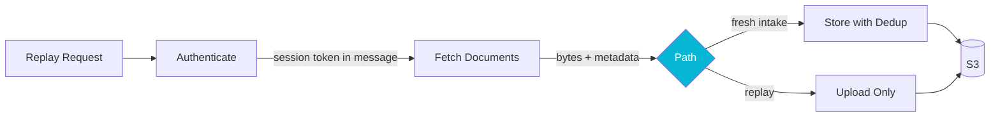

## The Problem

"Just replay it" is the most common operator instinct in any document-processing pipeline, and it is the right instinct. A step failed, the inputs are still on disk, run it again. The pipeline is supposed to be idempotent.

The pipeline is almost never idempotent in the ways operators assume. Two failure modes recur, and they come from different sources.

The first is **credential material persisted alongside intermediate state.** A pipeline that authenticates against a court system, fetches documents, and stores them often has a tempting place to drop the session cookie: the same JSONB document that records every other step's output. Now the cookie outlives the dispatch that minted it, lives on disk indefinitely, and is impossible to rotate without surgery. A replay months later picks up an expired cookie, the fetch returns garbage, and the pipeline cheerfully stores the garbage.

The second is **deduplication keys that ignore content.** Storage layers often dedup on a business identifier like `(firmId, courtDocumentId)` and short-circuit duplicate writes to the same object key. That is correct for fresh-intake. It is silently wrong for replays where the operator wanted to overwrite a corrupted object: the replay short-circuits to the bare key of the original (corrupted) row, no exception, no log, no overwrite.

Both bugs hide. Neither throws. You only notice them when an auditor or a customer notices them for you.

## The Approach

For the [pipeline workers](/case-studies/pipeline-workers) I built at a law-tech startup, two rules cover both failure modes.

**Rule 1: session tokens are ephemeral.** The credential-authenticator sub-processor returns only the auth-result metadata (which credential, which method) to the orchestrator's JSONB column. The actual session cookie or bearer token rides in the dispatch message to the document-fetcher sub-processor and is discarded after the HTTP request completes. Nothing rotatable lives on disk. A replay re-authenticates from a fresh credential, full stop.

**Rule 2: replay storage uses a non-deduplicating path.** The default storage path in the legacy system is idempotent on `(firmId, courtDocumentId)` and short-circuits writes for repeats. That behavior is correct for fresh intake; it is dangerous for replays. The replay path uses a separate `uploadOnly(prefix, doc, bytes)` entry point that bypasses dedup, accepts that the operator is intentionally re-uploading content, and writes whatever the replay produced.

A third, structural idea backs both rules: **a replay is not a mutation of the original run.** In the platform's replay design, a replay forks a fresh processing context linked back to its parent; the source context stays immutable, and every artifact the replay produces lands in a ledger with a supersede link to whatever it replaced. Lineage stays queryable, nothing is overwritten in place, and "which version of this document is live" is a ledger question rather than an archaeology project.

The second rule has a quiet caveat that is worth writing down. The non-deduplicating path is only safe if **every** writer on the replay branch uses it. The moment a new feature adds a different `store()` call to the replay flow, the legacy dedup short-circuits the write to the bare key of the original (corrupted) row, and the replay silently no-ops. The fix is not a band-aid at the storage layer; the fix is either a non-null file identifier on every replay-minted document, or a content-hash-based dedup key that actually reflects what is being stored.

## Results

The two rules survived contact with a real replay backlog. No persistent credential ever sat in JSONB; no replay ever silently dropped an upload on the floor. The latent non-idempotency around chained replays is documented in the team's tech-debt log so the next person to expand the replay surface is forced to confront it before, not after, the incident.

Two patterns from the broader literature on stateful systems land in roughly the same place: separate the "tells me about state" plane from the "carries credentials" plane, and never let a dedup key be a smaller fingerprint than the thing it is keying on. Both are usually free at design time and prohibitively expensive to retrofit once they are wrong.
